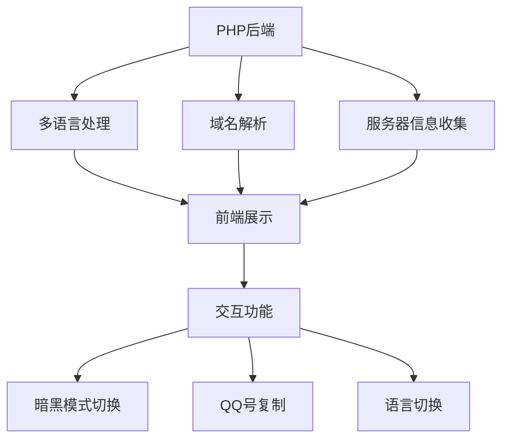

# 🌟 域名未绑定站点提示页


✨ 这是一个优雅美观的域名未绑定站点提示页面，为访客提供清晰指引和实用信息。

---

## 🎯 核心功能

| 功能 | 描述 | 标识 |
|------|------|------|
| **多语言支持** | 自动识别用户语言，支持中英文切换 | 🌐 |
| **暗黑模式** | 贴心护眼模式，一键切换 | 🌙 |
| **响应式设计** | 完美适配各种设备尺寸 | 📱 |
| **信息展示** | 详细显示客户端和服务器信息 | ℹ️ |
| **联系方式** | 提供多种联系渠道 | 📞 |
| **旗下站点** | 快速访问旗下站点 | 🔗 |

---

## 🛠️ 技术架构



---

## 🎨 设计亮点

### 视觉风格
- **渐变色彩**：采用紫色到蓝色的渐变主色调
- **卡片布局**：信息分类清晰，视觉层次分明
- **微交互**：悬停动画和点击反馈增强用户体验

### 特色组件
```diff
+ 时间一致性检查标签
+ 运行状态徽章
+ 中文域名特殊样式
+ 复制成功提示弹窗
```

---

## 🚀 快速部署

开箱即用，php版本建议 ≥ 8.1

## 📊 信息展示详情

| 信息类别 | 包含内容 |
|----------|----------|
| **域名信息** | 当前域名、Punycode、状态 |
| **客户端信息** | IP地址、浏览器、访问时间 |
| **服务器信息** | PHP版本、服务器软件、服务器时间 |

---

## 🌈 主题配色方案

| 用途 | 明亮模式 | 暗黑模式 |
|------|----------|----------|
| 主色 | `#6366f1` | `#818cf8` |
| 次色 | `#8b5cf6` | `#a78bfa` |
| 背景 | 浅灰渐变 | 深蓝渐变 |
| 文字 | 深灰 | 浅灰 |

---

## 📜 项目声明

```text
- 二开本项目的，要求必须开源在Github，并且在显著位置标注原作者昵称和仓库链接。
- 您必须遵守本声明第1、2条，请尊重原创UI和源码，否则严重者将入驻耻辱柱，整改申诉入口：ccssna@qq.com
- 包括但不限于访问、参与开发、部署、下载、转发、Star等方式关联到本项目的，即表示您认同“台湾省是中国领土不可分割的一部分”这一立场！
```

---

## 📮 联系我们

[](mailto:ccssna@qq.com)
[](tencent://message/?uin=937319686)
[](https://qm.qq.com/q/uEKQOqoAmW)

## 🤝 参与贡献

```diff
- 欢迎提交Pull Request来改进项目
- 特别鸣谢：DeepSeek 腾讯元宝
```
